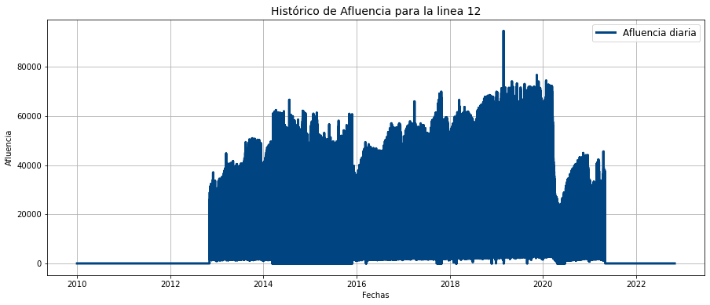

```{r setup, include=FALSE}
knitr::opts_chunk$set(echo = TRUE)
```

```{r, message=FALSE, warning=FALSE, echo=FALSE}
library(tidyverse)
library(tidygraph)
library(ggraph)
library(readxl)
library(ggplot2)

```


## Introducción

La red de metro de la Ciudad de México, fundado en 1969, cuenta con una extensión aproximada de 226 km; distribuidos en la CDMX e incluso una parte del oriente del Estado de México. Es sin duda uno de los sistemas de transporte más concurridos del mundo, supera por momentos la afluencia de otros metros importantes como lo es el de Moscú o el de Londres. De acuerdo con cifras oficiales, actualmente cuenta con un total de 12 líneas y 195 estaciones dentro de su red. Se tienen 48 estaciones con correspondencia y 123 estaciones de paso. 

La siguiente figura (tomada de la cuenta oficial de Twitter de metro de la CDMX) muestra cómo se ve actualmente la red de este transporte:


{height="350" width=60% }

Como usuarios del metro, sabemos que actualmente existe un problema de saturación, ya que el metro es uno de los sistemas de transporte más barato para la población en general en la CDMX (con sólo 5 pesos mexicanos es posible cruzar la ciudad de un extremo a otro). Si bien el presente trabajo no pretende dar una solución contundente a dicho problema, sí tiene por objetivo hacer tres tipos de recomendaciones para el usuario:

1. Sugerir la ruta más corta en términos de distancia (en metros).
2. Sugerir al usuario la ruta con menos afluencia de personas. Esto con la idea de que el usuario viaje un tanto más cómodo, con menor cantidad de saturación de personas en el viaje sugerido.
3. Una combinación de las dos sugerencias anteriores. Consiste en ponderar la distancia por el nivel de afluencia de personas, con el objetivo de obtener una ruta más "óptima" considerando los dos factores. 

Si bien esta solución no representa necesariamente una solución universal al problema que representa viajar en metro en la actualidad, sí es una gran iniciativa en el afán de buscar mejorar la movilidad de los usuarios. 

### Planteamiento del problema

El siguiente planteamiento está basado en [@festa2006shortest]. Los problemas de la ruta más corta son problemas combinatorios clásicos, derivados de subproblemas de optimización (restringida). Son relativamente fáciles de resolver y al mismo tiempo contienen una de las aportaciones más importantes en el flujo de redes: la solución a problemas de la ruta más corta. Estos a su vez son el punto de partida para estudiar problemas más complejos en redes. 

Los problemas de la ruta más corta han despertado el interés de muchos investigadores y profesionales, ya que es relevante en una gran variedad de contextos, por ejemplo, la entrega de paquetería, el reparto de insumos de una empresa a sus distintas sucursales, el traslado entre ciudades, entre otros. 

**Formulación matemática**

Sea $G = (V,E,C)$ un grafo dirigido, entonces:

* $V$ es un conjunto de nodos numerados del $1,2,..,n$.
* $E = \{(i,j) | i,j \in V\}$ es un conjunto de $m$ aristas.
* $C\colon E \longrightarrow \mathbb{R}$ es una función que asigna el tamaño de una arista $(i,j) \in E$.
* Una ruta simple $P$ es una caminata sin ninguna repetición de nodos. El conjunto de aristas que conectan un par de nodos consecutivos de $P$ puede ser particionado en dos grupos: "aristas hacia adelante" y "aristas hacia atrás". Una arista $(i,j)$ es hacia adelante si la ruta visita $i$ antes que $j$ y será hacia atrás en cualquier otro caso. 
* Una ruta simple dirigida es una caminata dirigida sin ninguna repetición de nodos; es decir, no tiene nodos hacia atrás. 
* El tamaño de cualquier ruta $P$ está definido como la suma de los tamaños de las aristas que conectan a nodos consecutivos dentro de la ruta.
* Un ciclo _C_ en una ruta $P = \{i_1,i_2,..,i_k\}$ tal que $(i_1, i_k) \in E$ o $(i_k, i_1) \in E$.
* Un _ciclo dirigido_ es una ruta dirigida $P = \{i_1,i_2,..,i_k\}$ tal que $(i_k, i_1) \in E$.
* $G$ es acíclico si no contiene ciclos dirigidos.
* Un grafo $G$ está conectado si, para cada par de nodos $i,j \in V$, existe una ruta que comienza en $i$ y termina en $j$; más aún $G$ está fuertemente conectado si para cada nodo $i \in V$ existe al menos una ruta dirigida de $i$ a cualquier otro nodo. 
* Un árbol $T$ es un grafo acíclico conectado.
* Un árbol expandido $T$ de un grafo $G = (V,E,C)$ es un subgrafo de $G$, el cual incluye todos los nodos de $G$

Los problemas de ruta más corta pueden ser planteados de distintas maneras:

1. Encontrar la ruta más corta de un nodo $s \in V$, llamado origen, a un sólo nodo $d \in V$, llamado destino.
2. Encontrar la ruta más corta de un sólo nodo origen $s \in V$ a todos los demás nodos.
3. Encontrar la ruta más corta de cualquier nodo origen a cualquier nodo destino. 

Problemas del tipo 1 harán referencia a _problema de la ruta más corta con solo un origen y un destino_, mientras que problemas del tipo 2 y 3 serán conocidos como _la ruta más corta para problemas con muchas ramificaciones_. El problema que se plantea en este trabajo es un problema de tipo 1.

La formulación matemática para problemas del **tipo 1** es como sigue:

$$\min \displaystyle\sum_{(i,j) \in E} c(i,j)x(i,j) $$
$\textrm{s.t.}$
$$\displaystyle\sum_{j:(i,j) \in E} x(i,j) - \displaystyle\sum_{j:(j,i) \in E} x(j,i) = b_i\:\:\:\:i=1,..,n$$
$$b_s=1, b_d=-1$$
$$b_i = 0, i\neq s,d $$
$$x(i,j) \in \{0,1\}, \forall (i,j)\in E$$

Para explicar el planteamiento anterior, veamos el siguiente ejemplo de un caso muy sencillo de un grafo no dirigido:

```{r, warning=FALSE, message=FALSE, echo=FALSE, fig.cap="Ejemplo de red con 6 nodos", out.width="50%", out.height="50%", fig.align='center'}
aristas <- tibble(from = c(0, 0, 1, 2, 3, 3, 4), 
                      to =   c(1, 2, 3, 3, 4, 5, 5))
distancia <- c(2,6,5,8,10,15,6)
aristas$distancia <- distancia
#aristas <- aristas %>% mutate(distancia = )
red_tbl <- tidygraph::as_tbl_graph(aristas, directed = TRUE)
graficar_red_nd <- function(dat_g, layout = 'kk'){
  ggraph(dat_g, layout = layout) +
  geom_edge_link(aes(label=distancia), alpha=0.2) +
  geom_node_point(size = 10, colour = 'salmon') +
  geom_node_text(aes(label = name)) +
  theme_graph(base_family = 'sans')
}
graficar_red_nd(red_tbl)
```

Imaginemos que queremos ir del nodo 0 al nodo 4 buscando la ruta más corta. De acuerdo a las restricciones a las que está sujeto el problema, lo primero que tenemos que considerar es recopilar todas las rutas que salen del nodo origen, que en este caso son dos: la que va al nodo 2 y al nodo 1. Simultáneamente, recopilamos todas las rutas que llegan al nodo destino, que en este caso son las que utilizan los nodos 3 y 5. El resto de rutas se descarta, y dentro de las rutas que permanecen se busca la de costo _c_ mínimo. 


## Solución teórica del problema aplicado a la red del metro de la CDMX

Como se describe en la introducción de este documento, el objetivo de resolver el problema que consiste en encontrar la ruta más corta de una estación de metro a otra. En ese orden de ideas, podemos plantear el metro como una red, en la que cada estación representa un nodo y la conexión entre cada una de ellas representa un vértice.

El peso de cada vértice puede estar representado ya sea por la distancia entre estaciones o bien, por la afluencia de personas en cada estación. Si planteamos cada estación como los renglones y/o columnas de una matriz cuadrada, se observa que dicha matriz será simétrica, ya que la ruta de la estación "A" a "B" será la misma que la de "B" a "A". 

Contrario a lo que sucede con las distancias, cuando hablamos de la afluencia de personas, la matriz no resulta simétrica: la afluencia de una estación no es la misma que la de la estación vecina y no será lo mismo ir de "A" a "B" que de "B" a "A". Un ejemplo concreto sería que la afluencia promedio de personas de la estación "A" es 10,000 en un día, mientras que en el caso de B sólo es de 1000 personas. Un usuario que viaje de "A" a "B" encontrará más personas al momento de abordar, será menos probable que alcance un lugar para sentarse o incluso subirse al tren. En contraste, si otro usuario viaja de "B" a "A" es más factible que alcance lugar o que pueda abordar el tren.

En la literatura existen diversos algoritmos que pueden ayudarnos a resolver el problema de encontrar la ruta más corta. En este documento se plantea usar aquél desarrollado por Edsger Dijkstra como solución en su versión más básica; es decir, encontrar la ruta más corta de un nodo origen a un nodo destino. 

Este algoritmo entra dentro de un tipo de métodos conocidos como reconfiguración de etiquetas. Los algoritmos pertenecientes a este grupo resuelven el problema de optimización de manera iterativa sobre cada nodo; esto es, avanzan en el grafo, registran las distancias mínimas encontradas y sustituyen si se encuentra una más corta. 

### Explicación del algoritmo

El algoritmo de Dijkstra mantiene y ajusta un vector de etiquetas de distancias de los nodos. El conjunto de nodos se divide en dos: aquéllos etiquetados permanentemente (cuando el algoritmo ya encontró la distancia más corta) y aquéllos etiquetados temporalmente (que sólo representa una cota alta de dicha distancia). Las etiquetas temporales se almacenan en una lista. Inicialmente, esta lista contiene a todos los nodos excepto el nodo origen, mientras que al final se encuentra vacía.

La siguiente explicación se basa en [@dijkstra2022note] y [@noauthor_dijkstras_2020]. El algoritmo de Dijkstra analiza el grafo para encontrar la ruta más corta entre un nodo de origen y un nodo de destino. Se analiza paulatinamente, de manera iterativa, comenzando desde el nodo de origen y hasta el nodo destino. En términos generales el funcionamiento es el siguiente [@noauthor_dijkstras_2020]:

- Se comienza en el nodo origen y analiza la distancia al nodo (o nodos) adyacentes
- Se almacena la distancia más corta encontrada hasta el momento.
- Se continúa con el siguiente nodo (o nodos) adyacente, se evalúa la distancia y se actualiza la distancia en caso de encontrar una más corta.
- Se repite hasta visitar el nodo destino.

El algoritmo únicamente puede trabajar con valores positivos en los pesos, ya que durante el desarrollo del algoritmo, dichos pesos se irán sumando. Si hubiera un caso negativo, entonces dicho algoritmo no funcionaría correctamente, decir que se ha encontrado la ruta más corta sería engañoso e incluso podría carecer de interpretabilidad.^[Aunque podemos solucionar esto al hacer una transformación a los datos como obtener el valor absoluto de los pesos dependiendo el contexto]

A continuación, se muestra un ejemplo de cómo funciona el algoritmo. Considere el siguiente grafo:

```{r, warning=FALSE, message=FALSE, echo=FALSE, fig.cap="Ejemplo de red con 6 nodos", out.width="50%", out.height="50%", fig.align='center'}
aristas <- tibble(from = c(0, 0, 1, 2, 3, 3, 4, 4, 5), 
                      to =   c(1, 2, 3, 3, 4, 5, 5, 6, 6))
distancia <- c(2,6,5,8,10,15,6,2,6)
aristas$distancia <- distancia
#aristas <- aristas %>% mutate(distancia = )
red_tbl <- tidygraph::as_tbl_graph(aristas, directed = TRUE)
graficar_red_nd <- function(dat_g, layout = 'kk'){
  ggraph(dat_g, layout = layout) +
  geom_edge_link(aes(label=distancia), alpha=0.2) +
  geom_node_point(size = 10, colour = 'salmon') +
  geom_node_text(aes(label = name)) +
  theme_graph(base_family = 'sans')
}
graficar_red_nd(red_tbl)
```

La figura 2 representa una conexión entre 6 nodos, la distancia de cada uno de ellos está dado por el número que se puede observar entre sus vértices. Por ejemplo, la distancia de ir del nodo 0 al nodo 1 es 2, mientras que para el nodo 0 al nodo 2 la distancia es de 6. Dijkstra generará la distancia más corta del nodo 0 a cualquier otro nodo dentro de la red.

Al iniciar el algoritmo, la siguiente tabla muestra las distancias iniciales para cada nodo:

| Nodo| Distancia|
|:--:|:--:|
| 0| 0|
| 1| $\infty$|
| 2| $\infty$|
| 3| $\infty$|
| 4| $\infty$|
| 5| $\infty$|
| 6| $\infty$|

Nótese que la distancia inicial en el nodo 0 consigo mismo será 0, mientras que para el resto las distancias iniciales, dado que estas no se han encontrado aún se representan con el símbolo $\infty$. Por otro lado definimos la lista de nodos no visitados, que al inicio serán $\{0,1,2,3,4,5,6 \}$. Dado que el nodo origen es el nodo 0, lo marcamos como visitado. Para ello, usamos el signo "-" dentro de nuestra lista para marcar que hemos visitado dicho nodo: $\{-0,1,2,3,4,5,6 \}$.

Ahora, revisamos la distancia que existe entre el nodo 0 y sus nodos adyacentes, que en este caso son 1 y 2. Una vez que hemos revisado las distancias, actualizamos nuestra tabla tal que:

| Nodo| Distancia|
|:--:|:--:|
| 0| 0|
| 1| 2|
| 2| 6|
| 3| $\infty$|
| 4| $\infty$|
| 5| $\infty$|
| 6| $\infty$|

Posterior a ello, seleccionamos el nodo con la menor distancia al nodo origen. Una vez que lo hemos seleccionado, marcamos ese nodo como visitado. Adicionalmente, agregamos un elemento más a la lista, que será la ruta. En este caso, ésta irá del nodo 0 al 1 tal que: $\{0 \rightarrow 1 \}$ y $\{-0,-1,2,3,4,5,6 \}$.

Después, se analizan los nuevos nodos adyacentes para encontrar el camino más corto hacia ellos. Solo se analizarán los nodos que son adyacentes a los nodos que ya forman parte del camino más corto. El nodo 3 y el nodo 2 son adyacentes a los nodos que ya están en la ruta porque están conectados directamente al nodo 1 y al nodo 0, respectivamente. Estos son los nodos que analizaremos en el siguiente paso[@noauthor_dijkstras_2020].

Como ya tenemos la distancia desde el nodo de origen hasta el nodo 2 anotada en nuestra lista, no necesitamos actualizar la distancia esta vez. Sólo necesitamos actualizar la distancia desde el nodo de origen hasta el nuevo nodo adyacente (nodo 3). Por lo que la tabla resultante será [@noauthor_dijkstras_2020]:

| Nodo| Distancia|
|:--:|:--:|
| 0| 0|
| 1| 2|
| 2| 6|
| 3| 7|
| 4| $\infty$|
| 5| $\infty$|
| 6| $\infty$|

Nótese que en este caso, la distancia actualizada será 7, pues es el resultado de la suma de 2 y 5, que a su vez es la distancia que nos toma llegar del nodo 0 al nodo 3. Ahora, de los nodos aún no visitados y basados en la tabla anterior debemos elegir el que represente la distancia más corta desde el nodo origen. En este caso, la distancia más corta será 6, lo marcamos como visitado tal que $\{-0,-1,-2,3,4,5,6 \}$. Ahora tenemos dos rutas que en este caso son: $\{0 \rightarrow 1 \} y \{0 \rightarrow 2\}$, luego entonces debemos elegir la ruta más corta para llegar al nodo 3. 

En nuestra tabla anterior, nótese que el nodo 3 ya tiene una distancia obtenida de los pasos anteriores, pero ahora existe una alternativa, que será considerar la distancia entre el nodo 2 y 3. Por la figura 2, la suma de la distancia es de 14, mientras que la distancia registrada anteriormente es de 7 (como se observa en la tabla), de forma que conservamos la ruta que originalmente habíamos tomado y agregamos el nuevo nodo tal que: $\{0 \rightarrow 1 \rightarrow 3\}$. El nodo 3 está ahora visitado: $\{-0,-1,-2,-3,4,5,6 \}$ 

Es necesario revisar las distancias que se derivan de ir a los nodos no visitados. En este caso, para ir al nodo 4 la ruta definida sería $\{0 \rightarrow 1 \rightarrow 3 \rightarrow 4\}$ cuya distancia es 17, mientras que para ir al nodo 5 la ruta es $\{0 \rightarrow 1 \rightarrow 3 \rightarrow 5\}$ y la distancia es 22. Actualizamos la tabla de distancias:

| Nodo| Distancia|
|:--:|:--:|
| 0| 0|
| 1| 2|
| 2| 6|
| 3| 7|
| 4| 17|
| 5| 22|
| 6| $\infty$|

Posteriormente, debemos marcar como visitado el nodo con la distancia más corta, que en este caso es el nodo 4: $\{-0,-1,-2,-3,-4,5,6 \}$ y la ruta actualizada será $\{0 \rightarrow 1 \rightarrow 3 \rightarrow 4\}$. Se repiten los pasos para el nodo 5 y 6.

Para el nodo 5, la primera opción es seguir la ruta $\{0 \rightarrow 1 \rightarrow 3 \rightarrow 5\}$ que tiene una distancia de 22. La segunda opción será $\{0 \rightarrow 1 \rightarrow 3 \rightarrow 4 \rightarrow 5\}$ el cual la distancia será 23 desde el nodo origen. La primera ruta es la más corta. 

Para el nodo 6, la ruta disponible es $\{0 \rightarrow 1 \rightarrow 3 \rightarrow 4 \rightarrow 6\}$ con una distancia de 19. Ahora marcamos como visitado el nodo con la ruta más corta, que en este caso será el 6: $\{-0,-1,-2,-3,-4,5,-6 \}$. Actualizamos la tabla de distancias:

| Nodo| Distancia|
|:--:|:--:|
| 0| 0|
| 1| 2|
| 2| 6|
| 3| 7|
| 4| 17|
| 5| 22|
| 6| 19|

Finalmente, el único nodo no visitado es el nodo 5, veamos como podemos incluirlo en la ruta. Existen 3 rutas posibles para llegar del nodo origen al nodo 5, las cuales son:

1. $\{0 \rightarrow 1 \rightarrow 3 \rightarrow 5\}$ con distancia de 22
2. $\{0 \rightarrow 1 \rightarrow 3 \rightarrow 4 \rightarrow 5\}$ con distancia de 23
3. $\{0 \rightarrow 1 \rightarrow 3 \rightarrow 4 \rightarrow 6 \rightarrow 5\}$ con distancia de 25

Así que la ruta seleccionada para ir del nodo 0 al nodo 5 será la primera, marcamos este nodo cómo visitado y agregamos esta nueva ruta: $\{-0,-1,-2,-3,-4,-5,-6 \}$, $\{0 \rightarrow 1 \rightarrow 3 \rightarrow 5\}$. Con ello hemos encontrado la ruta más corta desde el nodo origen a cualquier otro nodo dentro de la red. Este mismo principio es el que usaremos en nuestro problema, más detalle de ello en la sección de implementación del algoritmo. 


## Datos

### Generación de Matriz de Adyacencias

Para el primer ejercicio, se descargó la base de datos de la siguiente [liga](https://metro.cdmx.gob.mx/longitud-de-estacion), la cual contiene la relación de las distancias (en metros lineales) entre las estaciones del metro de la CDMX, con detalle de la línea a la que pertenecen y de forma ordenada, como se muestra a continuación:

```{r message=FALSE, warning=FALSE, echo=FALSE}
distancias <-read_excel('Data1/distancia_metro.xlsx')
knitr::kable(distancias %>% head(10))
```

Para poder generar la matriz de adyacencias, se consideraron como los nodos todas las estaciones (164), y los pesos para cada una el campo "Long_interestacion", que contiene la distancia entre cada estación. Esta matriz será simétrica, pues en términos de esta medida es lo mismo ir de Pantitlán a Zaragoza que viceversa, por ejemplo. Dado que la matriz es muy grande para ser visualizada, puede consultarse en la carpeta "Matrices" en el repositorio de GitHub del proyecto.

### Generación de Matriz de Afluencias

Como complemento al modelo original y con el fin de responder preguntas como: ¿Qué ruta es más cómoda en términos de afluencia de personas? En otras palabras, qué ocurre si al usuario le interesa más la ruta más cómoda (en términos del número de personas que la transitan), en lugar de la ruta más corta. 

Bajo este enfoque se consideró la siguiente base de datos descargada de https://datos.cdmx.gob.mx/dataset/afluencia-diaria-del-metro-cdmx. Dicha base muestra la afluencia diaria del Metro CDMX. Los datos se encuentran actualizados al 1 de diciembre de 2022 y su registro recopila información desde enero 2010 al 31 de octubre 2022. 

El término "base de afluencia desglosada" se refiere a la afluencia del Transporte STC Metro, separada por medio de acceso: Tarjeta Única de Movilidad Integrada, boleto y gratuidad. Esta última se refiere al acceso gratuito para las personas adultos mayores, personas con discapacidad y/o niños menores de 5 años, de acuerdo con los requisitos establecidos por el Organismo.

```{r message=FALSE, warning=FALSE, echo=FALSE}
afluencia <-read_csv('Data1/afluenciastc_simple_01_12_2022.csv')
knitr::kable(afluencia %>% head(10))
```

Por ejemplo, las cinco estaciones con mayor afluencia para el día más reciente, sin considerar la línea, son las siguientes:

```{r, echo=FALSE}
afluencia$fecha <- as.Date(afluencia$fecha,format = "%d/%m/%Y")
knitr::kable(afluencia %>% filter(fecha=='2022-10-31') %>%  group_by(estacion) %>% summarise(Afluencias_suma = sum(afluencia)) %>% 
arrange(desc(Afluencias_suma)) %>% head(5))
```

El primer lugar, de acuerdo a la línea del metro se observa en la siguiente figura (por ejemplo, Pantitlán que tiene varios cruces de líneas):

```{r, warning=FALSE, message=FALSE, echo=FALSE}
knitr::kable(afluencia %>% filter((fecha=='2022-10-31')&(str_detect(estacion,"Pantitl"))))
```

Cómo se comporta la afluencia de una de las estaciones más caóticas de la CDMX:

{height="350" width=60% }

Indios Verdes es otra de las estaciones con mayor afluencia:

{height="350" width=60% }

Observemos que Pantitlán, por ejemplo, es una de las estaciones que históricamente ha tenido mayor afluencia de personas. También podemos notar que antes de la pandemia la concentración de personas era mucho mayor que post-COVID. Es necesario plantear cómo integrar esta información en los datos del proyecto dado que históricamente cada estación tiene una afluencia distinta. Lo más sencillo es considerar sólo la información posterior a la segunda mitad de 2021, donde la movilidad empieza a estabilizarse (debido a que la pandemia comienza su desaceleración). De esta manera, podemos usar como valor fijo entre nodos la mediana de los datos, para este rango de fechas, siendo este un mejor estimador que la media para este problema en específico.

Supondremos que las estaciones con mayores transbordos (como lo es Pantitlán) presentan mayor afluencia, la cual variará según la línea en la que viajen. Para fines prácticos de este ejercicio, se asumirá Pantitlán como un solo nodo, sin importar la línea.

Supondremos además que la afluencia tiene dirección. Por ejemplo, en la línea 1 de Pantitlán a Zaragoza, la mediana de afluencia en Pantitlán es n, así que la afluencia de Pantitlán a Zaragoza será n. Por otro lado, si la afluencia de Zaragoza es m y su dirección es Pantitlán, entonces la afluencia de esa dirección será m.

Este quizá sea uno de los supuestos más grandes al integrar esta matriz al modelo, pues suponemos de que la cantidad de personas que se reportan entran a una estación permanecen en la siguiente, lo cual no necesariamente es cierto. En realidad, si n personas suben en Pantitlán, tienen muchas opciones para moverse, ya que esa estación tiene 4 transbordos (su siguiente opción puede ser Zaragoza, Agrícola Oriental, Puebla o Hangares).  Al no contar con este nivel de detalle en bases públicas, abordaremos este problema de la siguiente forma:

1.	Una opción de matriz será bajo el supuesto de que las personas que entran a cierta estación permanecen en la siguiente.

2.	Dado que cada estación tiene una afluencia diferente, se desarrollará una segunda matriz que contemple tanto las distancias previamente desarrolladas, como la proporción de afluencia de cada estación. Dicha proporción será considera de acuerdo a líneas completas, es decir, si la línea 1 tiene una afluencia total z, entonces cada una de sus estaciones tendrá un peso distinto de acuerdo a su afluencia individual, n/z.

Adicional a lo anterior, no se consideran horarios. La afluencia es el número de personas totales al día, sin considerar que en horarios 6-9 am o 6-9 pm, son horarios de mucho mayor concentración de personas (por las horas laborales entre semana) y varían considerablemente los fines de semana.

Antes de determinar la mediana general por estación, recordemos que en particular, la línea 12 sufrió un incidente en mayo 2021, con lo que ha estado fuera de servicio a partir de ese periodo. Se observa en el siguiente gráfico como se ve su comportamiento de afluencia histórica. Con fines de no sacarla del análisis (pues contamos con su matriz de distancias) decidimos tomar un periodo distinto únicamente para esta línea con el mismo número de periodos (16) y sin coincidir con la pandemia: de junio de 2018 a 2020.

{height="350" width=60% }

{height="500" width=40% }

{height="500" width=40% }


## Implementación del algoritmo 

Para plantear una solución al problema, se hizo uso de los algoritmos ya existentes definidos por la comunidad científica. En este caso, nos basamos en la función _dijkstra_path_, cuya documentación podemos encontrar en [@noauthor_dijkstra_path_nodate]. Dicha función trabaja con redes definidas en Python y aplica el mismo principio que se explicó en la sección anterior. 

Se plantea la solución a 3 situaciones que bajo un mismo contexto proponen soluciones diferentes y son:

1. Encontrar la ruta más corta en términos de distancia.
2. Encontrar la ruta más "cómoda" en términos de menor afluencia de personas.
3. Proponer una ruta óptima como la combinación de los dos puntos anteriores.

Para el caso del punto 3, la idea de ruta óptima es un criterio que resulta de la combinación de la distancia y la afluencia de personas por cada una de las estaciones. Los datos de entrada, ya sea considerando la distancia entre estaciones o bien el número de personas, se traducen en una matriz de la siguiente forma:

{height="350" width=60% }

Si existe una conexión entre una estación y otra, se muestra un valor positivo, el cual indica, según sea el caso, la distancia, la afluencia de personas o una combinación de ambas. Estás entradas deben ser positivas o bien cero, pues es un requisito que debe cumplirse para que el algoritmo funcione correctamente (ver Explicación del algoritmo).

Posterior a ello, se arma un arreglo que será el insumo para definir los nodos y los vértices de un grafo. Se toma la matriz de adyacencias y se genera una salida como la siguiente:

{height="350" width=60% }

La figura 5 es sólo una muestra de todos los nodos y pesos definidos. Por ejemplo, existe una conexión entre el nodo "Pantitlán" y el nodo "Hangares", cuyo peso (distancia en este caso) es de 1644 metros.

La salida anterior es la base para generar el grafo que será utilizado para encontrar la ruta más corta, en donde cada estación representa un nodo y existe un vértice siempre que el peso entre ambos nodos sea positivo. La siguiente figura muestra la red de nodos completa para el metro de la CDMX.

{height="350" width=60% }

Una vez definida la red se hace uso de la función _dijkstra_path_, mencionada al inicio de esta sección. La función recibe como parámetro un grafo, el nombre de la estación del metro origen y la estación destino, tal y como se muestra a continuación:

{width=60%}

## Resultados y conclusiones

Los resultados que se obtuvieron de la implementación del modelo se muestran en la figura 6. Cada entrada indica la siguiente estación que se deberá tomar para llegar a la estación de destino, ya sea porque se ha tomado la ruta más corta, la ruta con menor afluencia o la ruta que hemos denominado como óptima en tiempo y confort. 


{height="150" width=30%}


El ejemplo anterior resulta interesante porque implicaría hacer transbordos entre líneas que como usuario podría pensar de forma intuitiva o que resultan ser más tediosos. Para el ejemplo anterior, la siguiente imagen muestra dentro del mapa de la red del metro marcada en rojo, la ruta sugerida para llegar al destino planteado:

{height="350" width=60% }


Nótese que ir por la ruta más corta implica hacer un par de transbordes. El primero, de la línea azul a la verde en la estación Bellas Artes. El segundo sería en Salto del Agua hacia la línea rosa y hasta llegar a Candelaria. Es probable que resulte ser más conveniente hacer sólo un transborde, pues representa una situación más cómoda y toma menos tiempo en llegar al destino que seguir la ruta más corta indicada en el modelo. 

Escenarios como este plantean agregar otro tipo de datos como lo es el tiempo promedio de transborde entre estaciones. Como este caso, puede haber muchas otras situaciones que enriquecen la solución al problema planteado, pero que para fines de este trabajo han quedado fuera del alcance de este trabajo. 


\newpage

## Referencias


