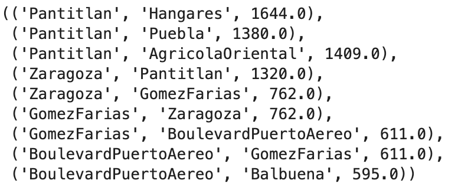

```{r setup, include=FALSE}
knitr::opts_chunk$set(echo = TRUE)
```

```{r, message=FALSE, warning=FALSE, echo=FALSE}
library(tidyverse)
library(tidygraph)
library(ggraph)
```


## Introducción

El metro de la Ciudad de México, fundado en 1969 cuenta con una extensión aproximada de 226 km que abarcan incluso una parte del oriente del Estado de México. Es sin duda uno de los sistemas de transporte más concurridos, llegando a superar por momentos la alfuencia de otros metros de ciudades tan pobladas como Moscú o Londres. Actualmente y de acuerdo a cifras oficiales el metro cuenta con un total de 12 líneas con 195 estaciones en total dentro de la red. Se tienen 48 estaciones con correspondencia y 123 estaciones de paso. La siguiente figura tomada de la cuenta oficial de twiter de metro de la CDMX muestra la red y cómo se ve actualmente:


{height="350" width=60% }

Como usuarios del metro, sabemos que actualmente existe un problema de saturación del sistema de transporte colectivo, pues sin lugar a dudas tal vez sigue siendo el sistema de transporte más barato para la pobación en general, pues con 5 pesos es posible cruzar la ciudad de un extremo a otro. Si bien, el presente trabajo no pretende dar una solución al problema de saturación, si tiene por objetivo hacer una recomendación sobre la ruta más corta cuando se quiere viajar de una estación a otra. O bien, como una segunda recomencación, queremos mostrar cuál sería la ruta más comoda en el sentido de que bajo dicha ruta encontrará menos afluencia de personas. Este última recomendación únicamente se basa en el promedio de personas por estación y no analiza otros factores que sin duda son importantes como podría ser las horas pico. Es decir, se plantea dar solución a un problema tan cotidiano como que ruta de metro tomar pero bajo un marco de optimización.

## Solución teórica del problema

Tal y como se describe en la introducción de este documento, la idea de poder resolver este problema consiste en encontrar la ruta más corta de una estación de metro a otra. En ese orden de ideas podemos pensar a la red de metro como una red en donde cada estacion respresenta un noda y la conexión entre cada una de ellas representa un vertice.

El peso de cada uno de los vertices puede estar representado ya sea por la distancia en metros que separa una estación de la otra o bien, por la afluencia de personas que puede haber de una estación a otra. Si pensamos cada estación como los renglones y columnas de una matriz cuadrada, es fácil ver que tratandose de las distancias la matriz resultante será simétrica, por lo que que la ruta más corta de la estación "A" a "B" será la misma que ir de "B" a "A". 

Contrario a lo que sucede con las distancias, cuando hablamos de la afluencia de personas la matriz no resulta ser simétrica: esto porque la afluencia de una estación no es la misma que la de la estación vecina, y no será lo mismo ir de "A" a "B" que de "B" a "A". Un ejemplo más concreto sería que la afluencia promedio de personas de la estación "A" es 10,000 personas en un día mientras que en el caso de B sólo es de 1000 personas, si yo, como usuario del metro viajo de "A" a "B" me encontraré más personas al momento de abordar y será menos probable que alcance un lugar para sentarme o siquiera que pueda subirme al tren, mientras que si viajo de "B" a "A" es mucho más factible que suceda lo contrario, es decir, que alcance algún lugar se vuelve más probable y más aún, que realmente pueda abordar el tren. 

En la literatura existen varios algoritimos que pueden ayudarnos a resolver este tipo de problemas de encontrar la ruta más corta, tal vez el uno de los más conocidos sea el método simplex, sin embargo en una red de nodos tan grande como lo es el metro, puede resultar ser poco factible, pues la función de optimización a plantear junto con todas las restricciones puede resultar ser poco manejable.

Existe otro algoritmo del cual se puede encontrar mucha literatura, publicado en 1959 lleva el nombre de su autor: el algoritmo de Dijkstra. Este algoritmo fue diseñado para encontrar la ruta más corta en una red extensa de nodos y a diferencia del método simplex no requiere definir una función de optimización ni mucho menos. 

### Explicación del algoritmo

La siguiente explicación se basa en [@dijkstra2022note] y [@noauthor_dijkstras_2020]. Básicamente el algoritmo de Dijkstra comienza en el nodo que el usuario elija (nodo origen) y analiza el grafo para encontrar la ruta más corta entre dicho nodo y un nodo destino que también será elejido por el usuario. En términos generales el funcionamiento es el siguiente [@noauthor_dijkstras_2020]:

- Se comienza en el nodo fuente y se va analizando cada distancia al nodo adyacente.
- Se almacena la distancia más corta encontrada hasta el momento
- Se continua con el siguiente nodo más adjacente, se evalúa la distancia y se actualizan las distancias mínimas en caso de econtrarse una distancia más corta.
- Se repite hasta visitar el nodo más lejano.

El algoritmo únicamente puede trabajar con valores positivos en los pesos, esto porque durante el desarrollo del algoritmo dichos pesos se irán sumando, si hubiera un caso negativo entronces dicho algoritmo no funcionaría correctamente pues decir que se ha encontrado la ruta más corta sería engañoso e incluso podrías caracer de interpretabilidad.^[Aunque podemos solucionar esto al hacer una transformación a los datos como obtener el valor absoluto de los pesos dependiendo el contexto]

A contunuación se muestra un ejemplo de como funciona el algoritmo. Considere el siguiente grafo:

```{r, warning=FALSE, message=FALSE, echo=FALSE, fig.cap="Ejemplo de red con 6 nodos", out.width="50%", out.height="50%", fig.align='center'}
aristas <- tibble(from = c(0, 0, 1, 2, 3, 3, 4, 4, 5), 
                      to =   c(1, 2, 3, 3, 4, 5, 5, 6, 6))
distancia <- c(2,6,5,8,10,15,6,2,6)
aristas$distancia <- distancia
#aristas <- aristas %>% mutate(distancia = )
red_tbl <- tidygraph::as_tbl_graph(aristas, directed = TRUE)
graficar_red_nd <- function(dat_g, layout = 'kk'){
  ggraph(dat_g, layout = layout) +
  geom_edge_link(aes(label=distancia), alpha=0.2) +
  geom_node_point(size = 10, colour = 'salmon') +
  geom_node_text(aes(label = name)) +
  theme_graph(base_family = 'sans')
}
graficar_red_nd(red_tbl)
```

La figura 2 representa una conexión entre 6 nodos, la distancia de cada uno de ellos esta dado por el número que se puede observa entre sus vertices, la distancia de ir del nodo 0 al nodo 1 es 2 mientras que ir del nodo 0 al nodo 2 la distancia es de 6. Dijksta generará la distancia más corta del nodo 0 a cualquier otro nodo dentro de la red.

Inicializamos el algoritmo, la siguiente tabla muestra las distancias iniciales para cada nodo:

| Nodo| Distancia|
|:--:|:--:|
| 0| 0|
| 1| $\inf$|
| 2| $\inf$|
| 3| $\inf$|
| 4| $\inf$|
| 5| $\inf$|
| 6| $\inf$|

Note que la distancia inicial en el nodo 0 consigo mismo será 0, mientras que para el resto las distancias iniciales, dado que estas no se conocen se inicializan con el simbolo $\inf$. Por otro lado definimos la lista de los nodos no visitados: $\{0,1,2,3,4,5,6 \}$. Dado que el nodo origen es el nodo 0, lo marcamos como visitado, para ello usarmos el signo "-" dentro de nuestra lista para dentar que hemos visitado dicho nodo: $\{-0,1,2,3,4,5,6 \}$.

Ahora, revisamos la distancia que existe entre el nodo 0 y sus nodos adyacentes, que en este caso son 1 y 2. Una ves que hemos revisado las distancias, actualizamos nuestra tabla tal que:

| Nodo| Distancia|
|:--:|:--:|
| 0| 0|
| 1| 2|
| 2| 6|
| 3| $\inf$|
| 4| $\inf$|
| 5| $\inf$|
| 6| $\inf$|

Y posterior a ello, seleccionamos el nodo cuya distancia es menor al nodo origen, una vez que lo hemos seleccionado marcamos ese nodo como visitado. Adicional, agregmos un elemento más a la lista, que será la ruta, en este caso esta irá del nodo 0 al 1 tal que: $\{0 \rightarrow 1 \}$ y $\{-0,-1,2,3,4,5,6 \}$

Ahora necesitamos analizar los nuevos nodos adyacentes para encontrar el camino más corto para llegar a ellos. Solo analizaremos los nodos que son adyacentes a los nodos que ya forman parte del camino más corto. El nodo 3 y el nodo 2 son adyacentes a los nodos que ya están en la ruta porque están conectados directamente al nodo 1 y al nodo 0, respectivamente. Estos son los nodos que analizaremos en el siguiente paso[@noauthor_dijkstras_2020].

Como ya tenemos la distancia desde el nodo de origen hasta el nodo 2 anotada en nuestra lista, no necesitamos actualizar la distancia esta vez. Solo necesitamos actualizar la distancia desde el nodo de origen hasta el nuevo nodo adyacente (nodo 3). Por lo que la tabla resultante será [@noauthor_dijkstras_2020]:

| Nodo| Distancia|
|:--:|:--:|
| 0| 0|
| 1| 2|
| 2| 6|
| 3| 7|
| 4| $\inf$|
| 5| $\inf$|
| 6| $\inf$|

Note que en este caso, la distancia actualizada será 7 pues es el resultado de la suma de 2 y 5 que es la distancia que nos toma llegar del nodo 0 al nodo 3. Ahora, de los nodos aún no visitados y basados en la tabla anterior debemos elegir el que represente la distancia más corta desde el nodo origen, en este caso la distancia más corta será 6 y marcamos este como visitado tal que $\{-0,-1,-2,3,4,5,6 \}$. Ahora tenemos dos rutas que en este caso son: $\{0 \rightarrow \} y \{0 \rightarrow 2\}$, luego entonces debemos elegir la ruta más corta para llegar al nodo 3. 

En nuestra tabla anterior, note que el nodo 3 ya tiene una distancia derivado de los pasos anteriores, pero ahora tenemos una alternativa que será considerar la distancia entre el nodo 2 y 3. Por la figura 2, la suma de estas distancias es de 14, mientras que la distancia ya registrada anteriormete es de 7 como se observa en la tabal, de forma que conservamos la ruta que originalmente habìamos tomado y agregamos el nuevo nodo tal que: $\{0 \rightarrow 1 \rightarrow 3\}$. Hemos llegado al nodo 3, así que ahora podemos marcarlo como visitado: $\{-0,-1,-2,-3,4,5,6 \}$ 

Hasta debemos de revisar las distancias que se derivan de ir a los nodos no visitados, en este caso para ir al nodo 4 la ruta definida sería $\{0 -> 1 \rightarrow 3 \rightarrow 4\}$ cuya distancia es 17, mientras que para ir al nodo 5 la ruta es $\{0 \rightarrow 1 \rightarrow 3 \rightarrow 5\}$ y cuya distancia es 22. Actuizamos de nueva cuenta nuestra tabla de distancias:

| Nodo| Distancia|
|:--:|:--:|
| 0| 0|
| 1| 2|
| 2| 6|
| 3| 7|
| 4| 17|
| 5| 22|
| 6| $\inf$|

Ahora, debemos marcar como visitado aquel nodo que nos haya dado la distancia más corta, que en este caso es el nodo 4: $\{-0,-1,-2,-3,-4,5,6 \}$ y la ruta actualizada será $\{0 \rightarrow 1 \rightarrow 3 \rightarrow 4\}$. Una vez más repetimos los mismos pasos para el nodo 5 y 6.

Para el nodo 5, la primera opción es seguir la ruta $\{0 -> 1 -> 3 -> 5\}$ que tiene una distancia de 22. La segunda opción será $\{0 \rightarrow 1 \rightarrow 3 \rightarrow 4 \rightarrow 5\}$ el cual la distancia será 23 desde el nodo origen, claramente la primera ruta es la más corta. 

Para el nodo 6 la ruta disponible es $\{0 \rightarrow 1 \rightarrow 3 \rightarrow 4 \rightarrow 6\}$ con una distancia de 19. Ahora marcamos como visitado el nodo con la ruta más corta, que en este caso será el 6: $\{-0,-1,-2,-3,-4,5,-6 \}$. Actualizamos la tabla de distancias:

| Nodo| Distancia|
|:--:|:--:|
| 0| 0|
| 1| 2|
| 2| 6|
| 3| 7|
| 4| 17|
| 5| 22|
| 6| 19|

Finalmente, el único nodo no visitado es el nodo 5, veamos como podemos incluirlo en la ruta. Existen 3 rutas posibles para llegar del nodo origen al nodo 5 que son:

1. $\{0 \rightarrow 1 \rightarrow 3 \rightarrow 5\}$ con distancia de 22
2. $\{0 \rightarrow 1 \rightarrow 3 \rightarrow 4 \rightarrow 5\}$ con distancia de 23
3. $\{0 \rightarrow 1 \rightarrow 3 \rightarrow 4 \rightarrow 6 \rightarrow 5\}$ con distancia de 25

Así que la ruta seleccionada para ir del nodo 0 al nodo 5 será la primera, marcamos este nodo cómo visitado y agregamos esta nueva ruta: $\{-0,-1,-2,-3,-4,-5,-6 \}$, $\{0 -> 1 -> 3 -> 5\}$. Con ello hemos encontrado la ruta más corta desde el nodo origen a cualquier otro nodo dentro de la red. Este mismo principio es el que usaremos para aplicarlo a nuestro porblema, más detalle de ello se puede ver en la sección de implementación del algoritmo. 


## Datos

Para el ejercicio, se obtuvo la base de datos de longitud en metrosentre estaciones del metro de la CDMX (long_interestacion) y la longitud de la estación particular (long_estacion). Los datos originales se pueden consultar en la siguiente [liga](https://metro.cdmx.gob.mx/longitud-de-estacion). 

De la misma manera, se creó una lista con todas las estaciones del metro y se pasó la información de la liga de CDMX a archivo plano para armar la matriz de adyacencias.

## Implementación del algoritmo 

Para poder plantear una solución al problema, se hizo uso de los algoritmos ya existentes definidos por la comunidad científca. En esta caso, nos basamos en la función _dijkstra_path_ cuya documentación podemos encontrar en [@noauthor_dijkstra_path_nodate]. Dicha función trabaja con redes definidas en python y aplica el mismo principio que se explicó en la sección anterior. 

Se plantea la solución a 3 situaciones que bajo un mismo contexto proponen soluciones diferentes y son:

1. Encontrar la ruta más corta con base en la distancia.
2. Encontrar la ruta más "cómoda" con base en aquella con menor afluencia de personas.
3. Proponer una ruta óptima considerando la combinación de los dos puntos anteriores.

Para el caso del punto 3, la idea de ruta óptima es un criterio propio como resultado de la combinación de la distancia y la afluencia de personas por cada una de las estaciones. Los datos de entrada, ya sea considerando la distancia entre estaciones o bien el número de personas se convierten a una matriz de la siguente forma:

{height="350" width=60% }

Si existe una conexión entre una estación y otra se muestra un valor positivo que indica, según sea el caso, la distancia, la afluencia de personas o una combinación de ambas. Estás entradas deben ser positivas o bien cero pues es un requisito que debe cumplirse para que el algoritmo funcione correctamente (ver Explicación del algoritmo).

Posterior a ello, se arma un arreglo que será el input para armar los nodos y los vertices de una grafo. Se toma la matriz de adyacencias y se genera una salida como la que sigue:

{height="350" width=60% }

La figura 2 es sólo una muestra de todos los nodos y pesos definidos, por ejemplo podemos ver que existe una conección entre el nodo "Pantitlan" y el nodo "Hangares" cuyo peso (distancia en este caso) es de 1644 metros.

La salida anterior es la base para generar el grafo que será utilizado para poder encontrar la ruta más corta en donde, como ya se mencionó cada estación representa un nodo, existe un vertice dentro de cada uno de ellos siempre que los pesos entre ambos sea positivo. La siguiente figura muestra la red de nodos completa para el metro de la CDMX.

**Agregar figura de la red**

Una vez definido red se hace uso de la función meniconada al inicio de esta sección. La función recibe como parámetro un grafo, el nombre de una estación del metro que sea el origen y una estación destino tal y como se muestra a continuación:

{width=60%}


## Resultados y conclusiones


## Referencias


